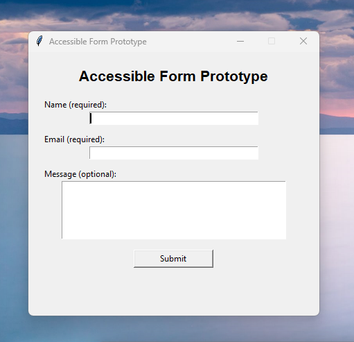
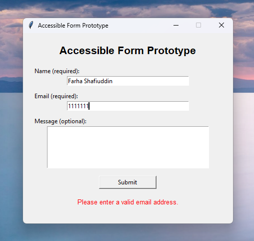

# Accessible Form Prototype  
**UX + Python Project**

## Overview
This project is a Python-based accessible form prototype designed with a strong
focus on usability, clarity, and inclusive design. It demonstrates how UX
principles can be applied even in desktop applications built with Python.

## UX Problem
Many forms are difficult to use because:
- Labels are unclear or missing
- Required fields are not obvious
- Error feedback is confusing or delayed
- Keyboard navigation is poorly supported

These issues disproportionately affect users with accessibility needs.

## UX Goals
- Create a clear, readable form layout
- Provide immediate, understandable feedback
- Support keyboard-first interaction
- Reduce cognitive load for users

## UX Decisions
- **Clear labels** placed directly next to inputs
- **Simple language** instead of technical wording
- **Logical tab order** to support keyboard navigation
- **High-contrast layout** and readable font size
- **Inline validation** to guide users before submission

## Implementation
- Language: Python
- UI Framework: Tkinter
- File: `app.py`

The focus of this project is not visual polish, but usability,
accessibility, and user guidance.

## What This Demonstrates
- UX thinking applied to software development
- Ability to translate UX principles into working code
- Accessibility-aware design decisions
- Python-based UI prototyping skills

## Future Improvements
- Screen reader testing
- Error message refinement
- Theme customization for low-vision users
- Conversion to a web-based accessible form

---

## Form

### Validation Feedback

### Completed Form

**UX Notes:**
- Clear labels for all fields
- Logical tab order for keyboard navigation
- Inline validation to guide users
- Accessible color contrast and font size

---

👩‍💻 **Author**  
Farha Shafiuddin  
Computer Science student focusing on UI/UX and Python
